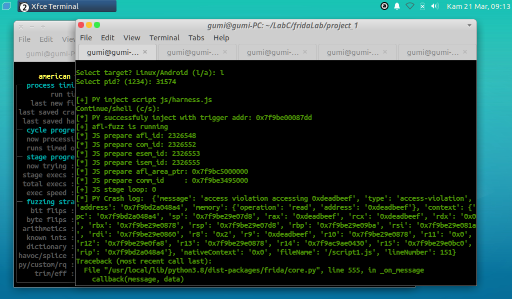
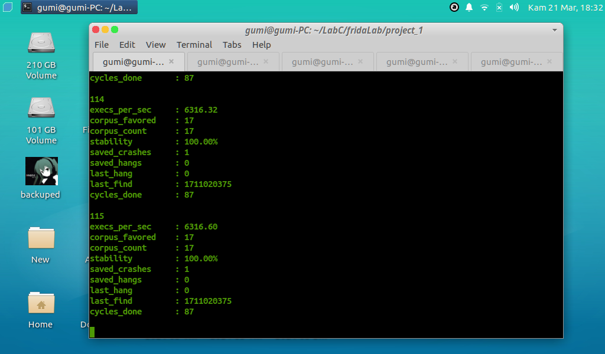

# Blackbox Fuzzing
Blackbox fuzzing for program or library target on x86 and arm android.
  

this using AFL++ for main fuzzer and frida
to attach the pid program target. this AFL++ collect the
path coverage using frida stalker and using shared mem for
communicate the payload and coverage from AFL++ to the program target.
 

this fuzzer inspiration from fpicker-fuzzer but i am not using
NativeFunction to call the target function because this is very slowly.
 

Alternatively i use a module that is injected into a target program that
has code to call the target function directly from the target program itself
which is loaded from the JS Frida harness. For versions that use NativeFunction,
please open it in the .release folder.
 

<b>afl result</b>

 

<b>frida result</b>

 

<b>android library fuzzing</b>

 

# USAGE:
<b>1. first run the afl-proxy</b>
`$ cd ccode`
`$ bash run`
 

<b>2. run the example target</b>
`$ cd examples`
`$ ./targetFuzz`
 

<b>3. find the pid target and run fuzzer</b>
`$ ps aux | grep targetFuzz`
`$ sudo ./run.py`
 

<b>4. get result</b>
log frida javascript in examples/.crash/data.txt
crash data for target examples/crash_result/2024-3-30-19-9-11
crash data for afl-fuzz .tmp/out/default/crash
  

# USAGE android:
1. patching the target lib using frida-gadget. 
2. run apk. 
3. find session host using `frida-ps -H 192.168.43.1` 
4. execute ccode/build.sh > cac, upload ccode/android_copy to android sdcard (if you don't have permission
   you can copy to /sdcard/android/data/com.<package>). 
5. if you need to fuzz library fuzzing, chose lib target for example lib to `examples/android/libandroid/lib/`
   then build your harness and set the `afl.js` and `run.sh` 
6. copy all library and fuzzer `./run.py > cf(copy_fuzzer) > input path` 
7. execute `./run.py > continue > select lib`  
8. and get view status `./run.py > continue > select libview`  
9. execute "./run.py" > Continue  
10. set the cpu_context->pc in harness.js from stalker cmodule  
11. run "./run.py"
  

# STEP for build:
1. cd ccode 
2. bash build.sh 
3. chose target for linux or android 

# STEP for patching android library:
1. pip install lief 
2. patching:
>>> import lief
>>> xx = lief.parse("libtarget.so")
>>> xx.add_library("libgadget.so")
<lief.ELF.DynamicEntryLibrary object at 0x7f0c66553c70>
>>> xx.write("libtarget.so")
  

# NOTE:
If the target does not have a Java API for fuzzer storage please edit the
variable not_java di js/harness.js

Reverse shell java only works with target running java, not working in binary target like
sshd, error marked frida.core.rpcexception: error: java API not available.
or use libmodule.so on condition that this ary library has been loaded into the target program.

Please set the variable `moduleProgram` and `targetPtr` in file
js/harness.js follow your target for starting fuzzing.

If the target function parameter has more than three inputs please edit the
C code `func_ptr` in afl_proxy /module/module.c in the callfuzz function and compile/build back.

For now how to collect errors from AFL++ is not correct so I created an alternative
code in the module that collects crash data in .crash/data.txt for javascript logs and
program_target/crash_result raw data that is similar to a folder crash in AFL.
